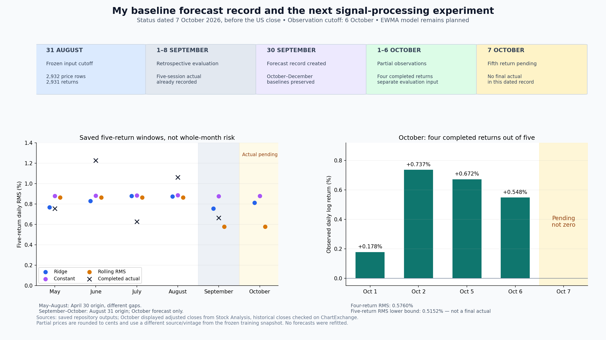
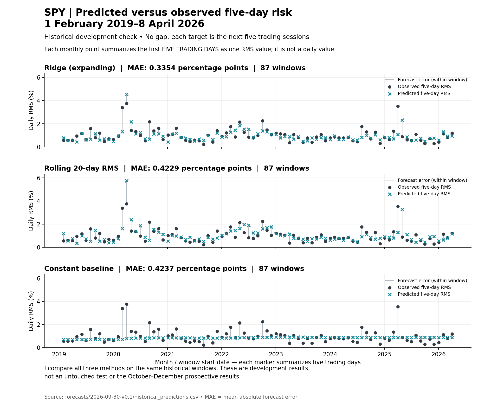
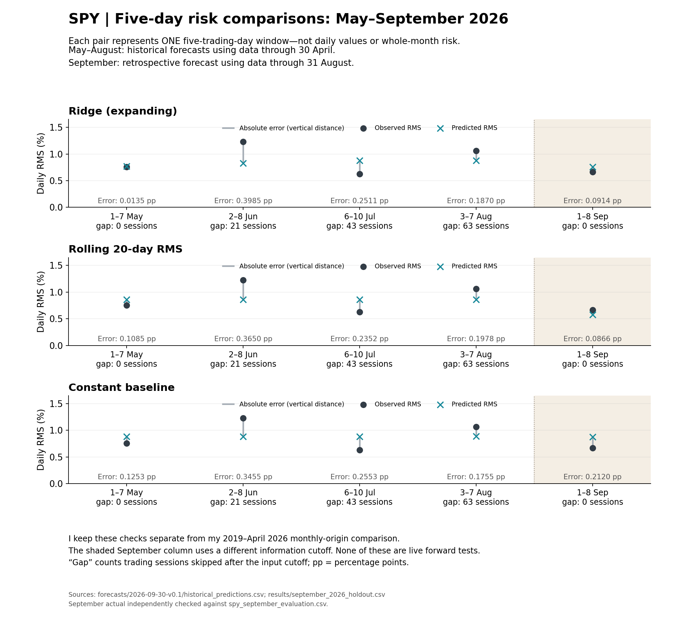
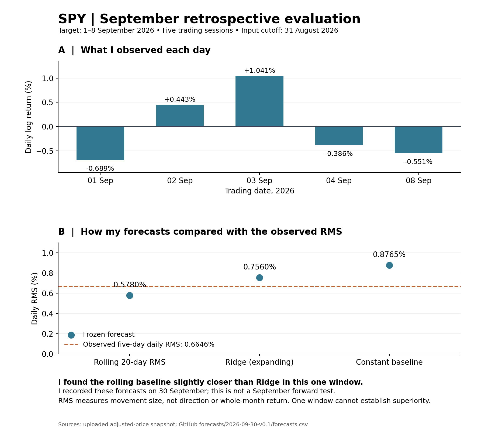
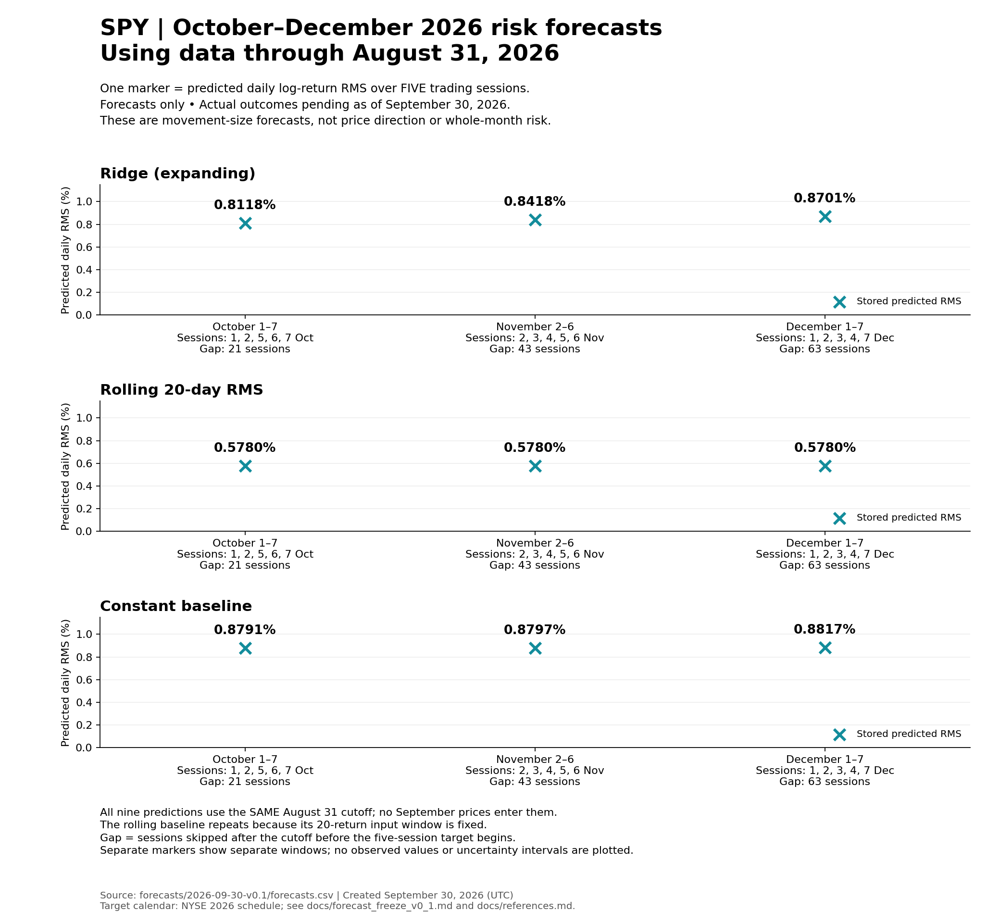

# Quant Market Lab II — Signal Processing & Prospective Forecasting

I am building Quant Market Lab II as a focused continuation of my earlier **Quant AI Market Lab** research project. My academic background is in mathematics and computer and system sciences, with research experience in probability, algorithms, optimization, randomized methods, and geometric reasoning. This project extends that foundation into quantitative finance by asking a narrower forward-looking question: whether carefully constructed market signals contain useful information for prospective risk forecasting when the information set is frozen in advance.

The purpose is not to claim that markets are reliably predictable. The purpose is to design an auditable forecasting experiment in which the cutoff date, target, features, model-selection rules, forecasts, and later evaluation are kept separate enough to expose look-ahead bias and overfitting.

## Status on 7 October 2026

I am starting the signal-processing extension with a [documented EWMA experiment plan](docs/signal_processing_plan.md). I have not fitted that extension or generated its forecasts. The existing October–December archive contains Ridge and two baseline forecasts.

As of the 6 October US close, four returns in the October 1–7 target window are observable. The fifth needs the 7 October close. My [dated status note](docs/evaluation_status_2026-10-07.md) explains the partial window, the final five-return calculation, data sources and timing. I do not score the original five-return forecast against a four-return actual.



The chart shows saved historical and September comparisons, the frozen October predictions, and four October daily returns. October's final actual is left pending. The prices used for this partial view are in a separate evaluation snapshot with provenance; they are not added to the frozen August training file.

I will test causal exponential smoothing against the existing baselines, using the same five-return RMS target and matched historical dates. My [mathematical notes](docs/figure_methodology.md#signal-processing-extension-recorded-7-october-2026) explain why this is my first signal experiment and link the recursion, initialization, validation plan and operation counts. Historical comparisons and a later prospective signal forecast will be recorded separately from v0.1.

## Research Question

The initial question is:

> **Using only information available through 31 August 2026, can a small set of signal-processing and time-series methods improve prospective market-risk forecasts relative to simple historical baselines?**

My first release preserves a compact baseline experiment: five-day SPY return RMS forecasts at four fixed lead times, using my existing Ridge approach and two simple baselines. I will add the signal-processing representation as a separate version after this forecast record is preserved.

## Relationship to Quant AI Market Lab

The earlier project established a broader historical quantitative-research workflow covering validated ETF data, return and covariance analysis, PCA, market-condition models, Ridge and Random Forest risk forecasting, chronological evaluation, and portfolio experiments.

This repository changes the experimental question:

- **Quant AI Market Lab:** historical modelling, interpretation, validation, and portfolio analysis.
- **Quant Market Lab II:** signal extraction, fixed-cutoff forecasting, uncertainty, forecast preservation, and later realized-versus-forecast evaluation.

## Frozen Information Set

The initial research cutoff is:

**31 August 2026**

For the frozen prospective experiment, no observation after that date may be used to construct features, scale inputs, select hyperparameters, fit the frozen model, or revise the stored forecasts.

Because the September five-session target was already observed during development, any September analysis must be labelled honestly as holdout or retrospective evaluation rather than as a forecast made before September began. Forecasts for later periods will be preserved with their Git history before those periods are evaluated.

## Initial Scope

### 1. Signal construction

I will begin with market series already motivated by the first project, including returns and volatility, and test one mathematically justified signal representation. Candidate methods include spectral analysis, causal filtering, or a state-space representation of latent risk. The first release does not need every method; the goal is to use only methods whose assumptions and limitations can be explained clearly.

### 2. Forecasting target

I forecast the RMS of daily SPY log returns over the first five scheduled trading sessions of September, October, November, and December 2026. All predictions use information through August 31. September is retrospective; October onward is prospective only when I publish the forecast before its window begins. These are five-day windows, not whole-month forecasts. I define the gaps, target dates, and training eligibility in [my forecast specification](docs/forecast_freeze_v0_1.md).

### 3. Baselines

The signal-based forecast must be compared with simple alternatives such as persistence, rolling historical volatility, or a constant historical estimate. Additional complexity is useful only if it improves a clearly defined out-of-sample metric or adds interpretable information.

### 4. Chronological validation

Model selection will use rolling or expanding historical validation. Future observations will not be shuffled into the training data. Any preprocessing that learns parameters from data must be fitted inside the corresponding training window.

### 5. Prospective forecast record

Frozen forecasts will be stored under `forecasts/` and committed before later evaluation. Original forecast files will not be silently rewritten after outcomes become known. Later model revisions will receive separate versioned outputs.

## Mathematical Focus

The project is designed to make the mathematics visible. The documentation will explain the relevant ideas behind discrete-time signals, frequency-domain representations where used, causal versus non-causal filtering, autocorrelation, state-space models where used, rolling-origin validation, forecast uncertainty, and computational complexity.

## Version Plan

### v0.1 — Prospective baseline

I have implemented and run the baseline forecasting pipeline. My [forecast record](forecasts/2026-09-30-v0.1/forecasts.csv), [input and source fingerprints](forecasts/2026-09-30-v0.1/manifest.json), [fitted models](forecasts/2026-09-30-v0.1/models.json), and [historical diagnostic scores](forecasts/2026-09-30-v0.1/historical_metrics.csv) are preserved together. The signal-processing extension remains future work. Reproduction commands and limitations are in [the release specification](docs/forecast_freeze_v0_1.md).

### v1.0 — Signal processing & prospective forecasting

Complete the selected signal method, baselines, chronological validation, uncertainty analysis where appropriate, reproducible figures, mathematical notes, and limitations.

### Possible later extension

If the core forecasting study is complete, I may extend the repository to a separate cross-asset question: whether the same information set can support relative ETF return or risk-adjusted ranking. That would be a new research module, not a missing requirement for the first release.

## Research Standard

I want the repository to distinguish clearly between what was known when a forecast was created and what was learned afterward. Negative results are valid results. If a signal-processing method fails to outperform a simple baseline, I will report that rather than redesigning the historical forecast after seeing the outcome.

This project is a research and learning exercise, not investment advice and not evidence of future profitability.

## How I read the results

I compare predictions with observed five-day RMS. Each marker summarizes five trading sessions; it is not a daily prediction or a whole-month average. I leave monthly markers disconnected because the intervening days are not represented by those points.

### Historical comparison: February 2019–April 2026



I compare the same 87 windows for all three methods. Ridge has the lowest average absolute error in this historical comparison. These are development results, not an untouched test.

### May–September 2026 comparison



The four May–August windows use an April 30 information cutoff and different session gaps. September uses an August 31 cutoff and zero gap. These windows are retrospective checks; their different origins are part of the experiment and must remain visible.

### September retrospective comparison



The observed daily RMS over September 1, 2, 3, 4 and 8 is approximately 0.6646%. Rolling RMS is slightly closer than Ridge in this window. That does not contradict Ridge's lower average historical error: one window and an average across 87 windows answer different questions.

I explain the target, geometry, feature construction, Ridge objective, SVD solution, baselines, training eligibility, errors and computational cost in [my mathematical and algorithmic notes](docs/figure_methodology.md). The [window table](results/figure_windows.csv) lists origins and target endpoints, and the [value table](results/figure_values.csv) gives the plotted numbers. My [references](docs/references.md) identify the method documentation, calendar and source data records.

To reconstruct the comparisons and check their saved numbers:

```bash
python -m pip install -r requirements-figures.txt
python -m src.plot_risk_comparisons
```

The reconstruction writes to `results/figures/rebuilt/`. The three selected figures above retain their approved layouts. This command checks the plotted data; it is not a full independent validation of the forecasting experiment.

### Published October–December forecasts



I show the nine stored predictions for the first five scheduled sessions of October, November and December. All use the same August 31 cutoff. Each point is a predicted daily RMS over its labelled five-session window, not a daily path, price direction or whole-month risk. Actual outcomes are pending as of September 30, 2026. The rolling baseline repeats because its information window is fixed; the direct Ridge and constant models use gap-specific training labels.

I reproduce this figure with `python -m src.plot_future_forecasts`. The script reads the preserved forecast CSV, checks the nine rows and their cutoffs and windows, and plots the stored values without refitting. Calendar and method sources are listed in [references](docs/references.md).

### A separate monthly-update experiment

The existing October–December forecast record uses the fixed August 31 cutoff. A proposed monthly-update experiment would refresh the information cutoff each month and predict the next five sessions at gap zero. I have not generated that new experiment here. Its outputs must be recorded separately with their actual creation times, without rewriting the frozen release.

