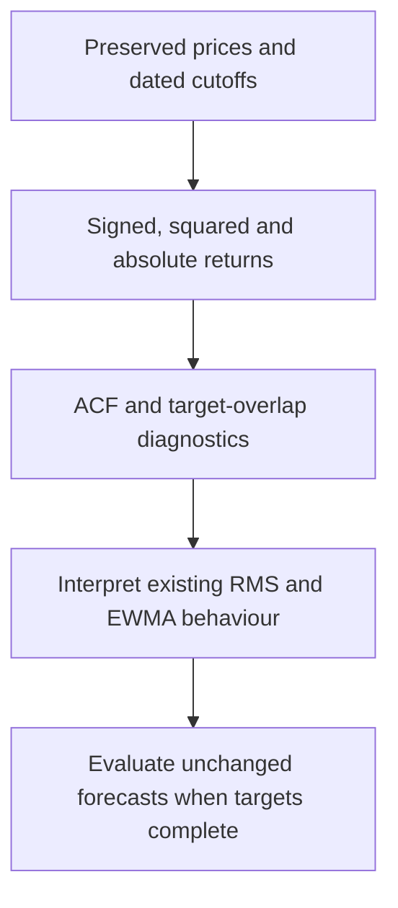
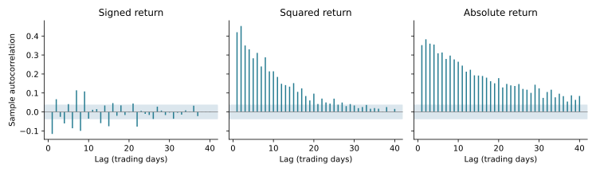
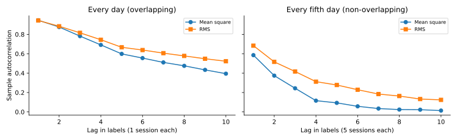
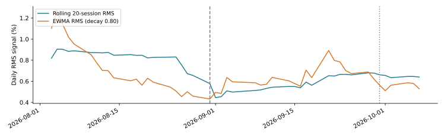
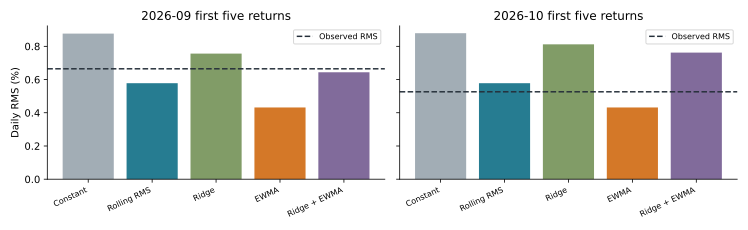
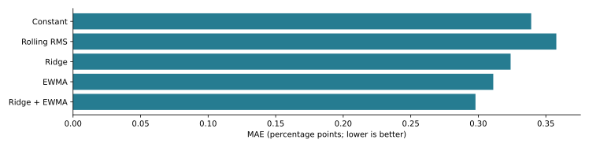
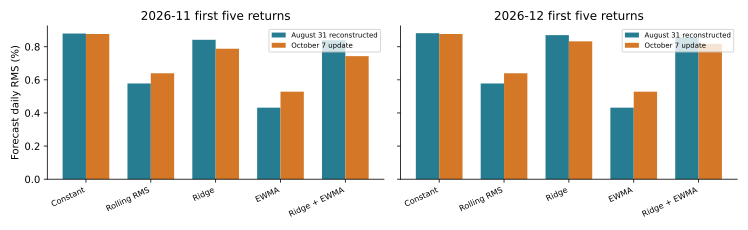

# Why I examine autocorrelation after my RMS and EWMA work

**Implemented on 10 October 2026.** I use autocorrelation to understand my existing risk experiment. I do not add a forecasting model, retune EWMA, or revise a frozen forecast in this update.

## My motive at this stage

I first defined a five-return SPY RMS target, preserved my baseline predictions, and compared them with completed outcomes. I then implemented EWMA using the same daily return history. Before adding more complexity, I want to understand the dependence in the data those methods already use.

My question is not simply whether returns are correlated. I want to distinguish **persistence in the direction of returns** from **persistence in their size**. My models predict the size of risk over specified windows; they do not predict which ETF will deliver the highest return.

Autocorrelation is useful here because it helps me interpret the weighting in rolling RMS and EWMA, check how shared target observations affect apparent persistence, and avoid mistaking a property of the data for evidence of forecast improvement. It is not a prerequisite that must have been completed before EWMA could run. This is a later diagnostic, not a claim that I used today's findings to select an earlier model.



## What I am asking, and what I already have

| My question | Existing input or output | What this update does |
|---|---|---|
| Does return direction persist linearly? | Preserved daily SPY returns | Computes signed-return ACF; does not build a direction forecast. |
| Does move size persist? | Squared and absolute SPY returns | Computes their ACF and compares the patterns. |
| Does target overlap create dependence? | Five-return mean-square and RMS labels | Shows overlapping and non-overlapping ACF separately. |
| How do my existing signals respond? | Recorded rolling RMS and EWMA states | Plots the observed extension through October 7. |
| Which existing method had smaller errors? | Saved matched historical and known-outcome tables | Replots the existing comparisons with their timing qualifications. |
| What happens in November and December? | Already published frozen forecasts | Displays predictions; future accuracy remains unknown. |

I need no new market samples for this historical diagnostic. ACF itself is not another forecasting model.

## The timelines I keep separate

| Information period | My use | Interpretation |
|---|---|---|
| Through August 31, 2026 | Preserved original adjusted-close CSV; 2,932 prices and 2,931 SPY returns | Historical ACF, recalculated on October 10. |
| September 2026 | Later observed returns and first-five-return outcome | September EWMA comparisons calculated in October are retrospective. |
| Through October 7, 2026 | Continuous September history and October 1, 2, 5, 6, 7 returns | Known observations and updated risk states. |
| October 8, 2026 | EWMA calculation and publication date | Not an October 8 observation in this study. |
| November 2-6 / December 1-7 | Future first-five-return targets | Frozen prospective predictions, pending evaluation. |

I preserve the original v0.1 archive. My August ACF uses the verified original CSV. The observed extension uses the complete October Yahoo snapshot. The known-outcome and future comparison figures reuse tables labelled **August 31 reconstructed**. The separately verified-original forecasts agree at the displayed precision, but I retain their distinct provenance. I do not splice prices from different download vintages.

The [publication record](../results/ewma_2026-10-08/publication_record.json) records the October 8 freeze commit. Newly calculated August-cutoff forecasts for September or early October cannot be described as forecasts published before those outcomes. November and December were still future windows at publication.

## Mathematics and exact estimator

For adjusted close P and daily log return r, I use:

```math
r_t=\log(P_t/P_{t-1}),\qquad
Y_{t,g}=\sqrt{\frac{1}{5}\sum_{j=1}^{5}r_{t+g+j}^2}.
```

Here g counts trading sessions between the information cutoff and first target return. RMS is not demeaned standard deviation, annualized volatility, or cumulative return.

For a weakly stationary population series, autocorrelation is:

```math
\gamma(k)=\mathrm{Cov}(X_t,X_{t+k}),\qquad \rho(k)=\gamma(k)/\gamma(0).
```

My sample estimator, for N observations, is:

```math
\bar{x}=\frac{1}{N}\sum_{t=1}^{N}x_t,\qquad
c_k=\frac{1}{N}\sum_{t=1}^{N-k}(x_t-\bar{x})(x_{t+k}-\bar{x}),\qquad
\widehat\rho(k)=c_k/c_0.
```

I divide every autocovariance by N, not N-k. The common denominator cancels in the ratio and corresponds to the unadjusted sample ACF. A constant series has c_0 = 0, so my function raises an error rather than inventing a correlation. A full-sample ACF is descriptive when the distribution changes over time; it does not establish a stationary mechanism.

The existing EWMA recurrence remains:

```math
v_{20}=\frac{1}{20}\sum_{j=1}^{20}r_j^2,\qquad
v_t=dv_{t-1}+(1-d)r_t^2,\qquad s_t=\sqrt{v_t},\qquad
\widehat Y_{t,g}=s_t.
```

The selected standalone decay remains d = 0.80; the existing Ridge EWMA feature uses d = 0.90. Those selections came from the earlier 2021-2022 validation procedure, not these new diagnostics. EWMA estimates a second moment; a variance interpretation additionally needs a negligible conditional mean. Its plug-in RMS forecast is not the exact conditional expectation of the nonlinear RMS target.

## What I reproduced in the August data



*Figure 1. Forty trading-day lags, using the preserved original dataset. The shaded +/-1.96/sqrt(N) white-noise band is a rough reference, not a robust significance claim for heavy-tailed or volatility-clustered series. Inspecting many lags also introduces multiple comparisons.*

| Series | Lag 1 | Lag 2 | Lag 5 | Lag 20 |
|---|---:|---:|---:|---:|
| Signed return | -0.116 | 0.067 | 0.041 | -0.003 |
| Squared return | 0.420 | 0.453 | 0.283 | 0.096 |
| Absolute return | 0.352 | 0.383 | 0.309 | 0.178 |

Move-size dependence is stronger and more persistent than signed-return dependence in this sample. This is consistent with volatility clustering and motivates examining the behaviour of my existing risk signals. It does not prove that EWMA is optimal, that return direction is unpredictable by every method, or that these patterns are stable in every regime.

The earlier supplied draft motivated this diagnostic. Its PACF, Ljung-Box, subperiod, AR and claimed test-suite results are **not reproduced by this implementation**. I do not import those numbers as verified repository results. The new implementation produces ACF, target-overlap diagnostics and charts of already saved model outputs only.

## Why I check target overlap

Let Z_t = r_t squared be independent and identically distributed, with finite nonzero variance. For M_t, the average of five consecutive Z values:

```math
M_t=\frac{1}{5}\sum_{j=1}^{5}Z_{t+j},\qquad
\mathrm{Var}(M_t)=\mathrm{Var}(Z_t)/5,\qquad
\mathrm{Cov}(M_t,M_{t+k})=\frac{5-k}{25}\mathrm{Var}(Z_t).
```

Therefore the overlap-only ACF is (5-k)/5 for k = 1, 2, 3, 4, and zero for k >= 5. This calculation needs a finite fourth moment of returns. It is a formula for **mean square**, not an exact formula for RMS after applying square root.



*Figure 2. Mean-square and RMS labels are plotted separately. A lag on the right represents five trading sessions; a lag on the left represents one. The right-hand labels share no returns, but that does not make them independent. All plotted curves are observed historical ACF, not the independent-data formula.*

This prevents me from treating shared observations as extra independent evidence. My existing monthly target windows are separated; a future experiment with daily labels would need explicit overlap-aware evaluation. ACF close to zero would not establish independence either.

## Existing signals and completed outcomes



*Figure 3. October-snapshot signal states. Vertical lines mark August 31 and September 30. These are causal states reconstructed from known observations, not daily forecasts published in advance.*



*Figure 4. Existing August-cutoff reconstructed calculations versus observed first-five-return RMS. This is a retrospective EWMA comparison.*

September observed RMS is 0.6646%; October observed RMS is 0.5263%. Ridge + EWMA is closest in September; rolling RMS is closest in October. Standalone EWMA is below both outcomes. A ranking that changes between two windows does not establish a universal winner. These comparisons do not replace the original frozen baseline evaluation.



*Figure 5. Existing assessment over 44 matched target windows ending January 2023-August 2026. This period had already informed project development; it is not an untouched test.*

| Existing method | MAE (percentage points) | RMSE (percentage points) |
|---|---:|---:|
| Constant | 0.3392 | 0.5255 |
| Rolling RMS | 0.3578 | 0.6021 |
| Ridge | 0.3239 | 0.5279 |
| EWMA | 0.3111 | 0.4964 |
| Ridge + EWMA | 0.2979 | 0.4947 |

I can report these observed errors. I have not established statistical significance of the differences or superiority at the longer November/December lead gaps.

## What I can publish about November and December



*Figure 6. Already recorded forecasts, not future observed outcomes. The August comparison table uses the reconstructed vintage.*

| Existing method | August cutoff: Nov / Dec | October 7 cutoff: Nov / Dec |
|---|---:|---:|
| Standalone EWMA | 0.4319% / 0.4319% | 0.5287% / 0.5287% |
| Rolling RMS | 0.5780% / 0.5780% | 0.6398% / 0.6398% |
| Ridge + EWMA | 0.8389% / 0.8567% | 0.7430% / 0.8169% |

Standalone EWMA persists the cutoff second moment and therefore repeats across these future windows. Ridge uses separate gap-specific fits. A change between information cutoffs shows an update, not improved accuracy.

For November I need the October 30 anchor and November 2-6 closes. For December I need the November 30 anchor and December 1, 2, 3, 4 and 7 closes. I will score the unchanged forecasts only after the complete target is observed, using a documented consistent-source vintage.

## What I can and cannot answer

| Question | What I can answer now | What I cannot establish from this work |
|---|---|---|
| Is historical move size persistent? | The measured ACF in the preserved August sample. | A stable mechanism across all assets and regimes. |
| Does signed return dependence exist? | Its measured sample ACF. | A profitable direction strategy, or absence of all nonlinear predictability. |
| Does overlap matter? | Shared returns induce dependence in target labels. | Independence merely by choosing non-overlapping labels. |
| Did EWMA help? | Existing matched historical errors and retrospective window comparisons. | Significant, general or prospective superiority. |
| What is future risk? | Frozen five-return RMS point predictions. | Actual November/December accuracy, whole-month risk, calibrated intervals or tail probabilities. |
| Which ETF will outperform? | This experiment does not provide a return ranking. | Future investment returns or a trading recommendation. |

## Algorithm, computational claims and reproducibility

1. Check the exact six input files against their pre-existing Git blob IDs; record SHA-256 hashes. I do not download a new vintage.
2. Compute the preserved August SPY log returns and the ACF of signed, squared and absolute returns at lags 0-40.
3. Compute five-return mean-square/RMS labels; compare overlapping labels with every fifth label.
4. Read existing signal, historical-error, known-outcome and future-prediction tables. Check saved signal returns and the two completed five-return actuals against the October snapshot.
5. Write two ACF CSVs, six SVG figures, and a manifest into a new output directory; refuse overwrite.

For N observations and K lags, direct ACF costs O(NK) time and O(N+K) working storage for a stream. The overlap calculation has a fixed five-return window and O(N) time. My three return streams and four target streams are constant multiples of these costs. The existing EWMA stream has O(N) time and O(1) incremental state; retaining the full history takes O(N) storage. Plotting and reading saved model tables do not fit any model. These are algorithmic operation-count claims, not a measured runtime benchmark or an accuracy guarantee.

```bash
python -m pip install -r requirements-figures.txt
python -m unittest discover -s tests -p 'test_autocorrelation_analysis.py' -v
python -m src.autocorrelation_analysis
```

The default reconstruction writes to `results/autocorrelation_2026-10-10/rebuilt/` and keeps the published files intact. For a second reconstruction, choose a new `--output` directory. No statsmodels dependency is required; its documentation supplies an independent reference for the estimator convention.

Four focused tests cover an independent double-loop ACF calculation, invalid/constant inputs, explicit target slices, and the mean-square overlap formula on simulated independent returns. Real-data checks verify source fingerprints, 2,931 August returns, cutoff dates, the saved signal returns, and completed target actuals. I do not claim these checks independently audit the whole forecasting project.

Next, I can investigate errors from my existing forecasts for systematic bias and remaining serial dependence. That residual analysis is planned, not completed in this update. It must respect actual target spacing. I do not need to introduce another model merely to perform that diagnostic.

## References and evidence

- [NIST/SEMATECH: Autocorrelation Plot](https://www.itl.nist.gov/div898/handbook/eda/section3/eda331.htm): common-N sample autocovariance and the distinction between lack of correlation and randomness. Consulted October 10, 2026.
- [statsmodels 0.14.4: ACF](https://www.statsmodels.org/v0.14.4/generated/statsmodels.tsa.stattools.acf.html): unadjusted denominator and context-dependent uncertainty bands. Consulted October 10, 2026. I use my own direct estimator, not this package at runtime.
- [My EWMA mathematics and protocol](ewma_experiment.md) and [freeze report](ewma_freeze_2026-10-08.md): existing recurrence, parameter selection, targets and publication timing.
- [Preserved original prices](../data/raw/original_august_verified/adjusted_close.csv), [ACF numbers](../results/autocorrelation_2026-10-10/august_acf.csv), [overlap numbers](../results/autocorrelation_2026-10-10/target_overlap_acf.csv), and [manifest](../results/autocorrelation_2026-10-10/manifest.json).
- [Known outcomes](../results/ewma_2026-10-08/august_known_outcomes.csv), [future comparison](../results/ewma_2026-10-08/cutoff_comparison.csv), and [verified-original historical metrics](../forecasts/2026-10-08-ewma-august-original-verified/historical_metrics.csv).

I use the supplied earlier autocorrelation draft as motivation. I publish only the calculations reproduced by the accompanying implementation and the already preserved forecast results.
