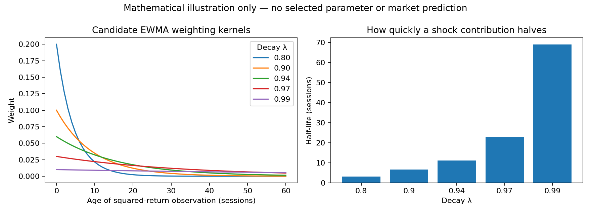

# My EWMA experiment: protocol fixed on 8 October 2026

**Update on 8 October 2026:** I initially expected a new download of the same historical series to reproduce my saved prices. When I compared the files, I observed that some adjusted prices differed between download vintages. This showed me why I need to use the preserved original dataset when reproducing the original experiment. I had kept that CSV locally; its SHA-256 exactly matches the original frozen manifest. The verified-original EWMA run selects the same decays and agrees with the reconstruction at the displayed precision. See [the original-data verification report](original_august_verification.md). Earlier freezes remain unchanged.


I chose EWMA because I can compute it from the adjusted-price return history already required by my RMS experiment. I am not claiming that it will outperform the other methods. I compare a standalone EWMA forecast and an EWMA feature added to my existing Ridge model against constant, rolling 20-session RMS and three-feature Ridge baselines.

**Current status, updated 8 October 2026:** Yahoo access was recovered after the initial HTTP 429 failures. I downloaded and validated all eight ETF series and calculated both cutoff experiments. The August file is a reconstructed current-vintage snapshot, not the recovered original bytes. Selected decays, forecasts, historical scores and graphs are now published in [the freeze report](ewma_freeze_2026-10-08.md). The original RMS archive remains unchanged.

The original August baseline used Yahoo Finance adjusted-close data. The completed October baseline evaluation used the saved Stock Analysis adjusted-price snapshot because Yahoo access was blocked. These are distinct records. Both new EWMA runs use the complete Yahoo adjusted-close snapshot downloaded on 8 October; I did not splice the six-price Stock Analysis snapshot into that history. The new August bytes differ from the original input hash and are explicitly labeled reconstructed.



## Two information cutoffs

| Experiment | Observations allowed | Interpretation |
|---|---|---|
| August baseline | Complete history ending 31 August 2026 | Newly calculated September/October results are retrospective. November/December predictions can be prospective only if published before their anchoring closes. |
| October update | Complete history ending 7 October 2026 | September and early October are known observations. November/December are future target windows. |

The October input must include the continuous September history, not just the six October snapshot prices. The same earlier validation rule is used for both cutoffs. Different cutoffs are different experiments; their performance does not isolate the effect of EWMA.

## Mathematics

For adjusted prices, my daily log return and five-session target are

$$
r_t=\log(P_t/P_{t-1}),\qquad y_{t,g}=\sqrt{\frac{1}{5}\sum_{j=1}^{5}r_{t+g+j}^{2}}.
$$

Here g counts sessions between the information cutoff and the first target return. RMS is not demeaned standard deviation. I model a second moment; interpreting it as variance additionally assumes a negligible conditional mean.

I initialize from the first 20 observed returns, then keep the state continuous:

$$
v_{20}=\frac{1}{20}\sum_{i=1}^{20}r_i^2,\qquad v_t=\lambda v_{t-1}+(1-\lambda)r_t^2,\qquad s_t=\sqrt{v_t}.
$$

The first 19 signal values are unavailable. The standalone forecast is persistence:

$$
\widehat y_{t,g}^{\mathrm{EWMA}}=s_t.
$$

It is identical across lead times at the same cutoff. It is a plug-in RMS prediction based on a persistent second-moment forecast, not an exact expectation of the square-root target. No mean reversion, return-direction forecast or confidence interval is implied.

The original feature vector contains SPY return, its 20-session sample standard deviation and the sample standard deviation across the eight ETF returns. The augmented model adds s_t as a fourth feature. I fit StandardScaler on eligible training rows only and solve

$$
\min_{\beta,b}\sum_{i\in\mathcal T_t}(y_{i,g}-b-z_i^\top\beta)^2+\|\beta\|_2^2,
\qquad\mathcal T_t=\{i:i+g+5\leq t\}.
$$

I require at least 504 completed labels, leave the intercept unpenalized, and report max(0, raw prediction), retaining the raw value in models.json. Each delayed target has its own training labels and fitted Ridge coefficients.

## Decay selection and assessment

I predeclare candidates 0.80, 0.90, 0.94, 0.97 and 0.99. For each candidate I walk through month-end origins whose next five-session target ends in 2021–2022. At each origin I use only labels completed by that origin. I select the lowest MAE separately for standalone EWMA and augmented Ridge. A tie after rounding MAE to 12 decimal places favors the larger decay. The same selected values are used at both 2026 cutoffs; observations after 2022 cannot influence selection.

I report MAE, RMSE and signed mean error on matched month-end windows ending January 2023–August 2026. This is development-aware historical evidence because the project has already studied this period. It is not an untouched test. Selection uses gap zero; applying that decay to delayed November/December windows does not demonstrate superiority at those lead times. I do not select parameters using September or October outcomes.

## Algorithm and complexity

1. Validate positive complete adjusted prices for exactly SPY, QQQ, IWM, TLT, GLD, USO, EEM and VNQ. Require the exact cutoff and exact agreement with a supplied exchange-session calendar.
2. Compute log returns and the causal EWMA states.
3. Select decays on the earlier walk-forward validation period.
4. Assess the matched historical windows, then fit each future window using completed labels at its cutoff.
5. Write predictions, signals, model coefficients, scores and a manifest into a new directory. Refuse overwrite.
6. Plot saved outputs. Publish the freeze before the relevant anchoring close; creation time alone is not proof of publication.

For N sessions and A assets, return computation costs O(NA). Each EWMA stream costs O(N) time and O(1) state for incremental updates; storing its history costs O(N). An n-row, d-feature SVD Ridge fit costs approximately O(nd²+d³), with d equal to 3 or 4. With G=5 candidate decays and M monthly origins, validation costs O(GM(NA+Nd²+d³)) in this straightforward implementation because features and signals are recomputed per fit. It favors clarity over cached computation. It stores O(NA+Nd) working data plus scores.

## Reproducible input and run instructions

Install the pinned packages in requirements-ewma.txt; exchange-calendars is also needed to reproduce input assembly. Run from the repository root with Python 3.10 or newer. Prices must be CSV with Date and the eight ticker columns. Provide separate immutable files ending exactly at each cutoff. The calendar CSV has a Date column containing the complete actual exchange-session schedule covering the entire input history and through 7 December 2026. Do not substitute unverified Monday–Friday dates.

For each input create a provenance JSON with price_source, price_column, retrieved_at_utc, input_sha256 and calendar_source. Record the actual provider and adjusted-price field; do not describe raw Close as Adjusted Close. Obtain the file hash with `sha256sum`. This records provenance supplied by the researcher; the code cannot certify the provider's adjustments.

```bash
python -m unittest discover -s tests -v
python -m src.run_ewma_experiment --data data/raw/adjusted_close.csv --calendar data/raw/nyse_sessions.csv --provenance data/raw/august_provenance.json --cutoff 2026-08-31 --require-original-august --output forecasts/ewma-august-freeze
python -m src.run_ewma_experiment --data data/raw/adjusted_close_2026-10-07.csv --calendar data/raw/nyse_sessions.csv --provenance data/raw/october_provenance.json --cutoff 2026-10-07 --output forecasts/ewma-october-freeze
python -m src.plot_ewma_experiment forecasts/ewma-august-freeze
python -m src.plot_ewma_experiment forecasts/ewma-october-freeze
```

The original-August flag requires the original frozen snapshot hash. If that file cannot be recovered, I must explicitly document a reconstructed input and run without that flag; I cannot claim identity with the original baseline. Manifests save input, calendar, code and output hashes, versions, selected parameters and UTC creation times. Plot files are generated afterward and should be included in the publication commit. A GitHub commit is the external freeze evidence. Existing outputs are never overwritten; a corrected run needs a new directory and an explanation.

## Figures and limits

The plotting code generates observed signal curves, historical MAE bars and future-window forecast graphs separately for each cutoff. Forecast markers are five-session summaries, not a daily path; connecting lines guide the eye only. Future actuals are not drawn. Exact dates, units, lead times and retrospective/prospective labels are in forecasts.csv. Real inputs passed validation and the market forecast charts are published in the freeze report.

EWMA cannot establish which ETF will outperform, predict return direction, guarantee smaller future errors, measure causal relationships or provide calibrated tail-loss probabilities. I forecast SPY RMS only. Two cutoffs cannot establish a robust model ranking, and historical errors do not supply calibrated prediction intervals. For future scoring I retain the prediction unchanged and evaluate against consistent-source adjusted-price returns after all five target sessions have completed.

## References

- [NIST: single exponential smoothing](https://www.itl.nist.gov/div898/handbook/pmc/section4/pmc431.htm): recursive weighting principle.
- [pandas exponentially weighted calculations](https://pandas.pydata.org/docs/reference/api/pandas.DataFrame.ewm.html): recursive adjust=False convention; my explicit seed differs from the default first-observation seed.
- [scikit-learn Ridge](https://scikit-learn.org/stable/modules/generated/sklearn.linear_model.Ridge.html): objective, intercept and SVD solver.
- [scikit-learn common pitfalls](https://scikit-learn.org/stable/common_pitfalls.html): preprocessing leakage.
- [NYSE hours and calendars](https://www.nyse.com/markets/hours-calendars): verify the session schedule and publication boundaries.

See [the methods review](signal_processing_methods_review.md) for alternatives and their data requirements. That review explains familiarity with other methods; it does not claim they have all been empirically fitted.

## Verification on 8 October 2026

All 21 repository unit tests passed. A temporary synthetic integration fixture also exercised decay selection, historical assessment, forecast export, manifest hash checks, all three plot outputs and overwrite refusal. The fixture was removed and no synthetic market results were published. Real-data checks have now also passed: complete calendar agreement, saved input/output hashes, completed-label boundaries, parameter minima and identical selection scores across cutoffs. The results and check record are linked in the freeze report.
