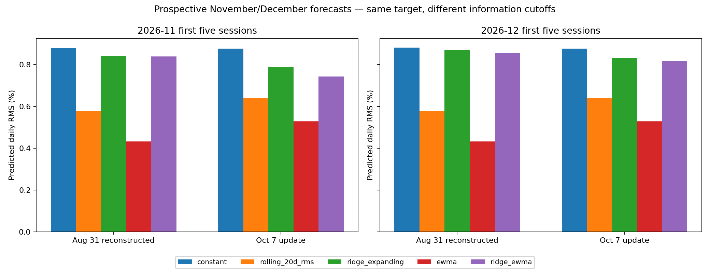
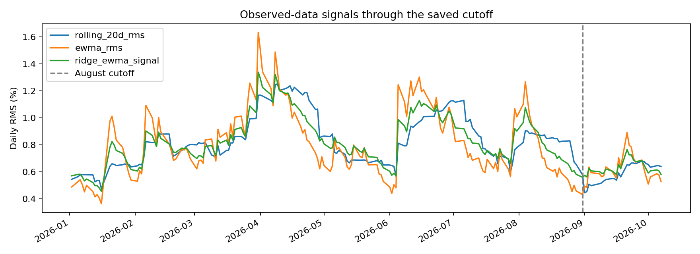
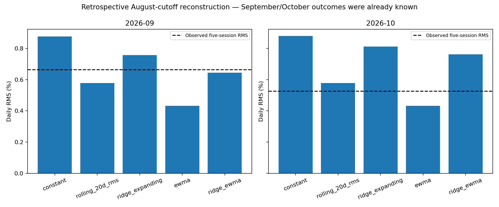
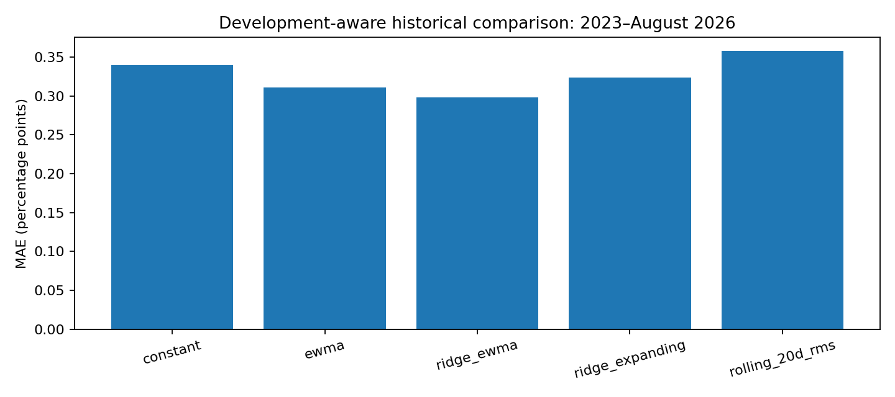

# My EWMA forecasts frozen on 8 October 2026

**Update on 8 October 2026:** I initially expected a new download of the same historical series to reproduce my saved prices. When I compared the files, I observed that some adjusted prices differed between download vintages. This showed me why I need to use the preserved original dataset when reproducing the original experiment. I had kept that CSV locally; its SHA-256 exactly matches the original frozen manifest. The verified-original EWMA run selects the same decays and agrees with the reconstruction at the displayed precision. See [the original-data verification report](original_august_verification.md). Earlier freezes remain unchanged.


I recovered access to Yahoo Finance and downloaded the complete adjusted-close history for all eight ETFs. I have now calculated the two EWMA experiments. I chose EWMA because it uses the return data already required by my RMS work. These results do not establish that EWMA is generally better.

## What I froze

| Item | August experiment | October update |
|---|---|---|
| Information cutoff | 31 August 2026 | 7 October 2026 |
| Price history | 2,932 sessions from 2 January 2015 | 2,958 sessions from 2 January 2015 |
| Dataset vintage | Downloaded 8 October; reconstructed | Downloaded 8 October |
| Missing observations | None against XNYS session calendar | None against XNYS session calendar |
| Standalone EWMA decay | 0.80 | 0.80 |
| Ridge EWMA-feature decay | 0.90 | 0.90 |
| Prospective targets | November 2–6; December 1–7 | November 2–6; December 1–7 |
| Lead gaps before first target return | 43 and 63 sessions | 17 and 37 sessions |

The August input hash differs from my original snapshot hash. I therefore call this an **August reconstruction**, not an exact recovery of the original dataset. A hash mismatch alone does not identify which prices, if any, changed. My original v0.1 forecast archive and its October evaluation are unchanged. Current adjusted-price history can contain later distribution adjustments or provider revisions, so historical validation is also subject to data-vintage limitations.

All new EWMA calculations use Yahoo's adjusted-close field consistently. The earlier October baseline evaluation used Stock Analysis. I do not join that six-price snapshot onto the Yahoo history. Source fields, retrieval times, raw responses, session calendar and hashes are preserved in [the input snapshot](../data/raw/yahoo_2026-10-08/README.md).

## Predictions

These are predictions of **daily RMS across five log returns**, expressed as percentages. They are neither annualized volatility nor five-day cumulative return predictions.

| Cutoff | Model | November 2–6 RMS | December 1–7 RMS |
|---|---|---:|---:|
| August 31 reconstructed | Constant | 0.8797% | 0.8817% |
| August 31 reconstructed | Rolling 20-session RMS | 0.5780% | 0.5780% |
| August 31 reconstructed | Original-feature Ridge | 0.8418% | 0.8701% |
| August 31 reconstructed | Standalone EWMA | 0.4319% | 0.4319% |
| August 31 reconstructed | Ridge + EWMA | 0.8389% | 0.8567% |
| October 7 | Constant | 0.8766% | 0.8767% |
| October 7 | Rolling 20-session RMS | 0.6398% | 0.6398% |
| October 7 | Original-feature Ridge | 0.7879% | 0.8325% |
| October 7 | Standalone EWMA | 0.5287% | 0.5287% |
| October 7 | Ridge + EWMA | 0.7430% | 0.8169% |



Standalone EWMA forecasts are equal across months because I persist the cutoff second moment. The augmented Ridge forecasts differ because each target uses a separate gap-specific fit. Different values from different information cutoffs do not prove that one model improved.

The complete numerical records, model coefficients and manifests are in [the August archive](../forecasts/2026-10-08-ewma-august-reconstructed/forecasts.csv) and [the October archive](../forecasts/2026-10-08-ewma-october/forecasts.csv). They were created today and published today, before the October 30 and November 30 anchoring closes. September and October calculations from the reconstructed August cutoff are retrospective; I do not backdate them as prospective forecasts.

## Observations through October 7



This graph plots signals computed from observations already available. The dashed August cutoff distinguishes the later observed extension. These are signal states, not a record of daily forecasts published in advance.



Using this Yahoo snapshot, September's first five-return RMS was approximately 0.6646%, and October's was 0.5263%. The augmented Ridge reconstruction was closest in September; rolling RMS was closest in October. These outcomes were known before this EWMA reconstruction was made. They are descriptive comparisons, not prospective evidence for the new EWMA model. Their exact values and errors are in [the retrospective score table](../results/ewma_2026-10-08/august_known_outcomes.csv).

## Earlier validation and historical assessment

I selected each decay using MAE on 24 five-session windows ending in 2021–2022, with expanding training using only labels completed at each origin. The selected standalone candidate had validation MAE 0.3104 percentage points; augmented Ridge had 0.2652 percentage points. September and October 2026 outcomes did not select the decay.

For the separate development-aware historical assessment, all methods used the same 44 target windows ending January 2023–August 2026:

| Model | MAE, percentage points | RMSE, percentage points |
|---|---:|---:|
| Constant | 0.3392 | 0.5255 |
| Rolling 20-session RMS | 0.3578 | 0.6021 |
| Original-feature Ridge | 0.3239 | 0.5279 |
| Standalone EWMA | 0.3111 | 0.4964 |
| Ridge + EWMA | 0.2979 | 0.4947 |



Augmented Ridge had the smallest error in this historical assessment. I do not present that as an untouched test, statistical significance or a guarantee of future performance. The project had already studied this historical period. Decays selected at gap zero are transferred to the longer future lead times; those lead-time choices still need prospective evaluation.

## Reproduction, mathematics and verification

My [experiment protocol](ewma_experiment.md) gives the recurrence, explicit 20-return seed, targets, completed-label rule, Ridge objective, complexity, alternatives and references. Install `requirements-ewma.txt` before running. A new download is a different data vintage; for faithful reproduction use the committed CSVs:

```bash
python -m src.run_ewma_experiment --data data/raw/yahoo_2026-10-08/august_adjusted_close.csv --calendar data/raw/yahoo_2026-10-08/nyse_sessions.csv --provenance data/raw/yahoo_2026-10-08/august_provenance.json --cutoff 2026-08-31 --output forecasts/reproduced-ewma-august
python -m src.run_ewma_experiment --data data/raw/yahoo_2026-10-08/october_adjusted_close.csv --calendar data/raw/yahoo_2026-10-08/nyse_sessions.csv --provenance data/raw/yahoo_2026-10-08/october_provenance.json --cutoff 2026-10-07 --output forecasts/reproduced-ewma-october
python -m src.plot_ewma_experiment forecasts/reproduced-ewma-august
python -m src.plot_ewma_experiment forecasts/reproduced-ewma-october
python -m src.summarize_ewma_freezes --august forecasts/reproduced-ewma-august --october forecasts/reproduced-ewma-october --prices data/raw/yahoo_2026-10-08/october_adjusted_close.csv --output results/reproduced-ewma-summary
```

The original-August-match flag is intentionally omitted because these reconstructed bytes do not match the original snapshot. A reproduction made later has a later creation time and may correctly be labeled retrospective by the code. It does not replace today's published forecast evidence.

All 21 unit tests passed. Real-data checks verified full calendar agreement, input/output hashes, nonnegative finite forecasts, completed training-label boundaries, identical pre-2023 selection scores across cutoffs and the selected minima. The [check record](../results/ewma_2026-10-08/freeze_checks.json) also fingerprints the plots. The manifests retain exact numeric forecasts, feature values, fitted parameters, versions and source hashes.

## What happens next

I keep these predictions unchanged. After all five target sessions have completed, I download a documented consistent-source adjusted-price series, calculate the actual log-return RMS and report signed error, absolute error and the matched model comparison. I record provider revisions or source discrepancies rather than changing the original forecast. November needs the October 30 anchoring price plus November 2, 3, 4, 5 and 6; December needs November 30 plus December 1, 2, 3, 4 and 7. Future actual outcomes are not yet available.
