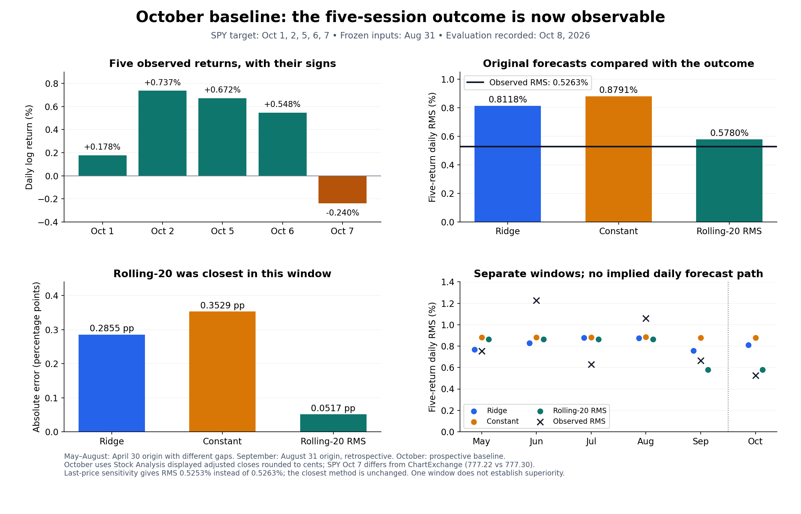
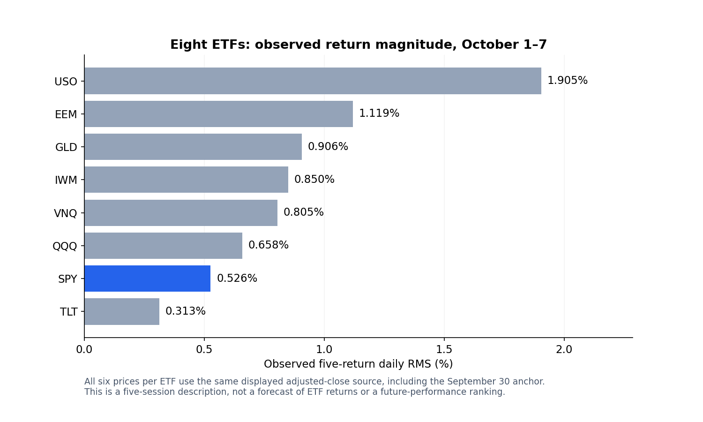

# My first completed October baseline evaluation

I recorded this evaluation on 8 October 2026, after the October 7 US session. I use the original three forecasts with their August 31 information cutoff. I did not retrain the models or change their predictions after observing October.

## What I measured

My target is SPY daily log-return RMS over October 1, 2, 5, 6 and 7. I need six adjusted closing prices: September 30 supplies the anchor for the first return. October 3 and 4 were weekend days; I do not add zero returns for them.

For adjusted close $A_i$, I calculate

$$r_i=\log(A_i/A_{i-1}),\qquad Y=\sqrt{\frac{1}{5}\sum_{i=1}^{5}r_i^2}.$$

The saved snapshot gives **$Y=0.0052625231$, or 0.5263%**. This is a daily-scale RMS over five returns. It is neither annualized volatility nor whole-month risk, and I do not subtract the mean. Population standard deviation instead satisfies $s^2=Y^2-\bar r^2$; I save it as a separate descriptive measure.

## Original predictions versus the observed snapshot

| Method | Frozen forecast RMS (%) | Observed RMS (%) | Forecast minus observed (percentage points) | Absolute error (percentage points) |
|---|---:|---:|---:|---:|
| Ridge | 0.8118 | 0.5263 | +0.2855 | 0.2855 |
| Constant | 0.8791 | 0.5263 | +0.3529 | 0.3529 |
| Rolling-20 RMS | 0.5780 | 0.5263 | +0.0517 | 0.0517 |

All three forecasts overestimated this window's RMS. Rolling-20 was closest. This is one absolute error per method, not an average across five independent forecasts. The five daily returns jointly define one target. I do not call the single-window error an established MAE advantage or evidence of statistical significance.



The upper-left panel shows all five signed daily returns. The upper-right panel compares the stored predictions with the completed-window RMS. The lower-left panel compares absolute errors. The lower-right panel places October alongside the existing May–September windows, without joining them into a daily forecast path. May–August use an April 30 origin and different gaps; September uses August 31 and is retrospective. October's baseline predictions were published before its window.

## Why I waited, and what I preserved

The October 7 close was needed for $r_5$. The [October 7 status note](evaluation_status_2026-10-07.md) described only four returns available through October 6. I leave that dated note and its partial chart intact. This new evaluation supersedes its pending status without rewriting what was known then.

I verify the forecast CSV against the original manifest's SHA-256 before scoring it. September is still retrospective. November and December outcomes are still pending. Their stored predictions remain unchanged. EWMA is still a separate [planned experiment](signal_processing_plan.md); no EWMA result is included here.

## Data source and an unresolved disagreement

I transcribed all six displayed **Adj. Close** prices for each ETF from Stock Analysis on October 8. Its pages attribute historical data to S&P Global Market Intelligence. These are rounded public prices from a different source and vintage than my frozen Yahoo training snapshot. I have not reproduced the evaluation with a full-precision download from the original provider.

The [input CSV](../results/evaluation_inputs/etf_october_2026_adjusted_close.csv) and [provenance record](../results/evaluation_inputs/etf_october_2026_provenance.json) document the source, precision, retrieval time and hash. TLT illustrates why adjusted prices matter: September 30's adjusted close is 77.47, while raw close is 77.78. I use 77.47 as its anchor.

ChartExchange's SPY historical **Close** column agrees with Stock Analysis on September 30 and October 1, 2, 5 and 6, but differs on October 7: **777.30 versus 777.22**. I do not claim those sources agree on the whole window or that the adjustment conventions were independently audited.

For a sensitivity check only, replacing the final SPY price with 777.30 gives RMS **0.5253%**, a change of about **-0.000921 percentage points**. Rolling-20 remains closest. This substitution is not a second validated adjusted-close series or a confidence interval. The completed-window result is conditional on the archived public snapshot; vendor reconciliation remains open. If I obtain a revised provider snapshot, I will save it separately and report whether the conclusion changes.

## Observed profiles of all eight ETFs



This additional chart describes return magnitude during the same five sessions. It does not score eight ETF forecasts: the original frozen forecasts were for SPY only. A lower observed RMS does not mean that an ETF will perform better in the future. The [profile table](../results/october_2026/etf_observed_profile.csv) also records mean log return, population standard deviation and the window's simple return, each with its own definition.

## Reproduction and computation

```bash
python -m pip install -r requirements-figures.txt
python -m src.validate_october_inputs
python -m src.evaluate_october_2026
python -m src.plot_october_2026
python -m unittest discover -s tests
```

These commands read saved files without downloading data or fitting a model. The evaluator writes [daily log returns](../results/october_2026/daily_log_returns.csv), [forecast errors](../results/october_2026/forecast_errors.csv), the ETF profile and a [summary with fingerprints and sensitivity](../results/october_2026/summary.json).

For $T$ returns, $A$ assets and $M$ forecasts, the numerical evaluation uses $O(TA+M)$ time and $O(TA+M)$ storage when retaining the tables. SHA-256 verification additionally reads $B$ bytes in $O(B)$ time; this implementation reads each hashed file into memory. Here $T=5$, $A=8$, $M=3$. No optimization or model-training cost belongs to this scoring step.

I ran 12 tests: the six existing forecast/partial-window tests, two input-validation tests and four evaluation tests. They check missing/duplicate/reordered dates, invalid prices, a known-return calculation, RMS versus demeaned standard deviation, invariance to constant price rescaling, forecast-window guards, signed errors and the observed source sensitivity. I also inspected both rendered figures. These checks cover calculations and preservation; they are not a vendor-data audit.

Method and data links are listed in [references](references.md). My broader [mathematical notes](figure_methodology.md) explain the frozen target and baseline construction.

## What I conclude from this window

Rolling-20 was closer than Ridge and the constant baseline in the first October window on the saved snapshot, and its ranking survives the checked last-price discrepancy. Ridge's better average historical result did not guarantee that it would win this individual window. I need additional prospective windows to assess consistency. This result does not establish return direction, future ETF ranking, a profitable trading strategy or that EWMA will improve the forecasts.

## Yahoo access and source comparison recorded later on 8 October 2026

My original Market Lab ingestion code used Yahoo Finance through `yfinance`, with `auto_adjust=False` and the `Adj Close` column. For this October evaluation I retained one complete Stock Analysis adjusted-price snapshot rather than assembling a series from partially verified sources.

During the subsequent Yahoo check, direct requests for the historical web page returned HTTP 429 (“Too Many Requests”). The accessible cached historical table ended on October 5. This was an access limitation in this session, not evidence that Yahoo lacked October 6 or October 7 data. I did not test a fresh `yfinance` download, so I do not claim its API was unavailable.

| Date, 2026 | Stock Analysis Adj. Close (USD) | Yahoo evidence available in this check | What I can conclude |
|---|---:|---|---|
| September 30 | 762.63 | Cached historical Close and Adj Close: 762.63 | Displayed adjusted prices match |
| October 1 | 763.99 | Cached historical Close and Adj Close: 763.99 | Displayed adjusted prices match |
| October 2 | 769.64 | Cached historical Close and Adj Close: 769.64 | Displayed adjusted prices match |
| October 5 | 774.83 | Cached historical Close and Adj Close: 774.83 | Displayed adjusted prices match |
| October 6 | 779.09 | Historical Close and Adj Close not directly verified | Adjusted-price agreement remains unverified |
| October 7 | 777.22 | Yahoo quote page: regular-session Close 777.22 | Close matches; historical Adj Close remains unverified |

Sources inspected: [Yahoo SPY cached historical table](https://finance.yahoo.com/quote/SPY/history/?p=SPY), [Yahoo SPY quote](https://ca.finance.yahoo.com/quote/SPY/), and [Stock Analysis historical adjusted prices](https://stockanalysis.com/etf/spy/history/). The quote's previous-close implication for October 6 is not independent verification of that date's adjusted close.

I found no confirmed Yahoo–Stock Analysis price mismatch in the entries I verified, but I cannot say that all six adjusted prices agree. The eight-cent October 7 discrepancy discussed above is with **ChartExchange**, not Yahoo. I retain the existing RMS and forecast-error results, explicitly conditional on the archived Stock Analysis snapshot. I do not replace an adjusted-price value with a quote or treat an access problem as a missing market observation. Full-precision original-provider reconciliation remains open; any later snapshot and comparison will be recorded separately.
