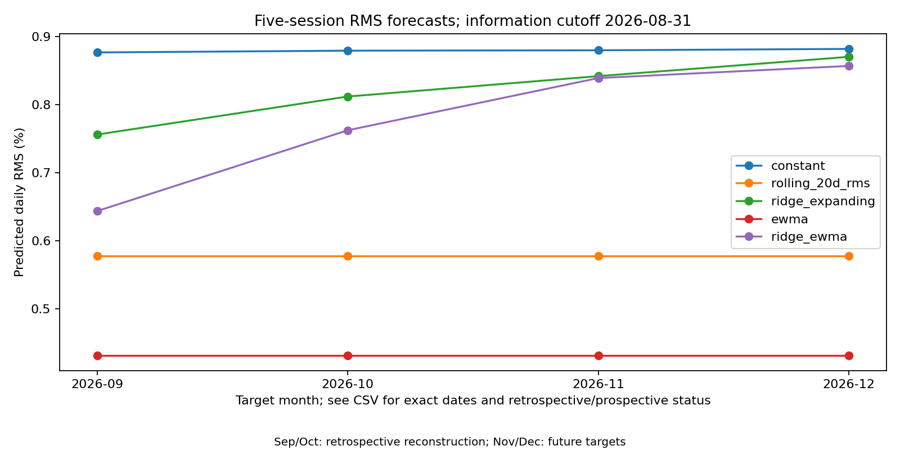

# Verification of my original August dataset — 8 October 2026

I had preserved the original CSV in my own folder. It was initially unavailable in the assistant's workspace, not lost. After I uploaded it, its SHA-256 matched the original v0.1 manifest exactly:

`637fdeb14b482a12b37abef1fce77f5f94b161c3a92ab28b28948dd3736a4c59`

The file has 2,932 sessions, 2 January 2015 through 31 August 2026, and all eight ETFs. The original-input availability limitation is now resolved. The previous August reconstruction is retained as a separate data-vintage record; it does not replace this verified original.

## What actually differs

The later Yahoo download has the same dates and assets but numerically different adjusted prices in 16,530 cells. This is not only CSV formatting. For example, SPY on 13 August is 777.8800048828125 in the original snapshot and 775.9531860351562 in the later download. These are adjusted prices from different download vintages, not evidence that the historical exchange closing transaction changed.

Prices in several assets differ approximately proportionally across the earlier history. Such scaling largely cancels in the ratio used for log returns. The largest absolute daily log-return difference across all assets is 0.0000015151, or about 0.00015151 percentage points. GLD and USO prices match exactly. The specific cause of the other provider changes has not been independently established; later dividend adjustments or revisions are possible explanations, not confirmed findings.

I reran the full August EWMA protocol using the verified original file and the mandatory original-hash check. Standalone decay remains 0.80; augmented Ridge decay remains 0.90. Across all 20 five-model/month predictions, the largest difference from the reconstruction is 0.0000000110749 in decimal RMS, or 0.00000110749 percentage points. All displayed forecasts agree to four decimal places in percent units.

| Model, verified original August cutoff | November 2–6 daily RMS | December 1–7 daily RMS |
|---|---:|---:|
| Standalone EWMA | 0.4319% | 0.4319% |
| Ridge + EWMA | 0.8389% | 0.8567% |

My [original CSV](../data/raw/original_august_verified/adjusted_close.csv), [provenance](../data/raw/original_august_verified/provenance.json), [verified-original forecasts](../forecasts/2026-10-08-ewma-august-original-verified/forecasts.csv), fitted models and manifest are preserved. Exact per-asset and forecast comparisons are in [the comparison directory](../results/original_august_verification_2026-10-08/).



## Interpretation and reproduction

This resolves exact input recovery for the original August baseline. It does not turn newly calculated September/October EWMA results into forecasts published before those outcomes. Those remain retrospective. The verified-original November/December predictions are an additional separately published freeze before their anchoring closes. The earlier reconstruction freeze and October 7 freeze remain unchanged.

```bash
python -m src.run_ewma_experiment --data data/raw/original_august_verified/adjusted_close.csv --calendar data/raw/yahoo_2026-10-08/nyse_sessions.csv --provenance data/raw/original_august_verified/provenance.json --cutoff 2026-08-31 --require-original-august --output forecasts/reproduced-original-august
python -m src.compare_price_snapshots --original data/raw/original_august_verified/adjusted_close.csv --new data/raw/yahoo_2026-10-08/august_adjusted_close.csv --original-forecasts forecasts/2026-10-08-ewma-august-original-verified/forecasts.csv --new-forecasts forecasts/2026-10-08-ewma-august-reconstructed/forecasts.csv --output results/reproduced-snapshot-comparison
```

The original retrieval timestamp was not recorded in the available manifest. I explicitly retain that uncertainty rather than invent a timestamp; the new provenance records when the file was supplied for verification. Its exact hash establishes identity with the earlier frozen input.
